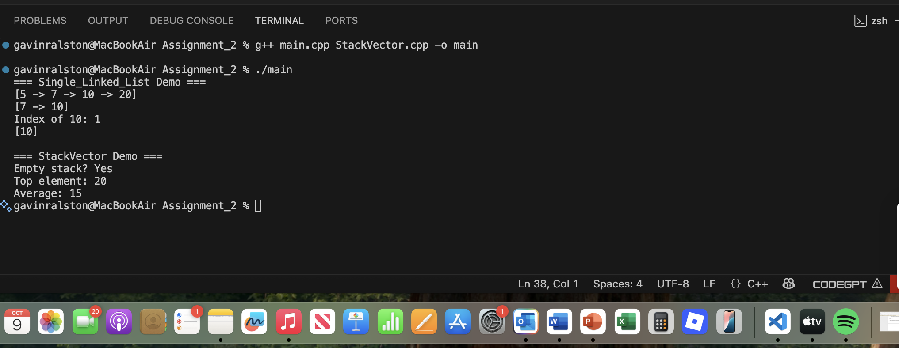

# Single_Linked_List & StackVector Project

## Description
This project contains:
- `Single_Linked_List.h` — header-only template implementation of a singly linked list with:
  - `push_front`, `push_back`, `pop_front`, `pop_back`, `front`, `back`, `empty`,
    `insert(size_t, const Item_Type&)`, `remove(size_t)`, `find(const Item_Type&)`, `size()`, `print_list()`.
- `StackVector.h` / `StackVector.cpp` — integer stack implemented using `std::vector<int>`.
- `main.cpp` — demo program that exercises both the linked list and the stack.

## Files
- `Single_Linked_List.h`
- `StackVector.h`
- `StackVector.cpp`
- `main.cpp`
- `README.md`

## Build instructions (Linux / macOS / Windows using g++)
1. Open a terminal/command prompt in the project folder.
2. Compile:
   ```bash
   g++ -std=c++17 main.cpp StackVector.cpp -o program
